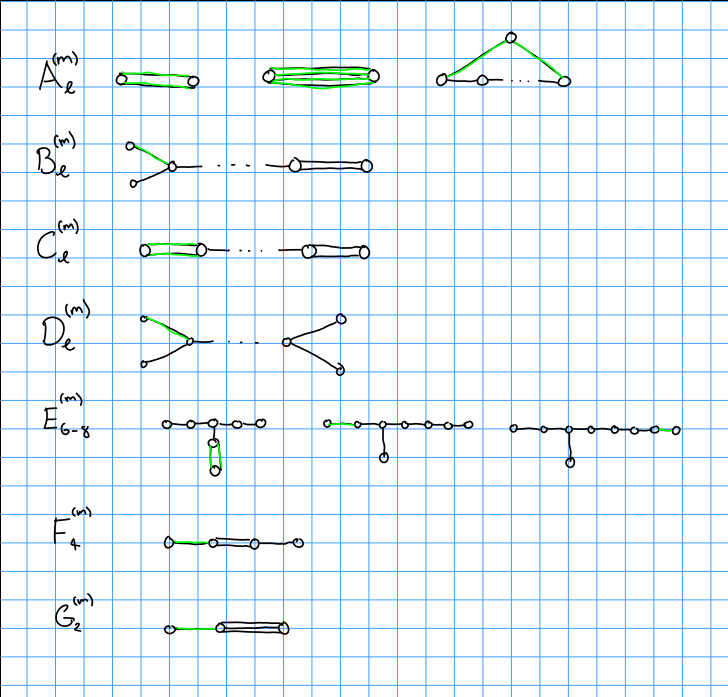

# Monday December 02

Last time:
Something about Engel.

Sketch of proof of (b):

$\implies$:
If $\lieh$ is abelian, then it is nilpotent, so $\lieg = \lieh + \sum_\alpha \lieg_\alpha$ and $N_\lieg(\lieh) = \lieh$.

$\impliedby$:
(a) implies that $\lieh = \lieg_{0, x}$ for some $x$, write $x = x_s + x_n$ using Jordan decomposition, then $\lieg_{0, x} \subseteq \sum {n\choose i} (\ad x_j)^i (\ad x_n)^{n-i}$.
From this, you can deduce that

\begin{align*}
\lieh 
&= \lieg_{0, x_s} \text{by regularity of $x$} \\
&= C_\lieg(x_s) \text{because $\ad x_s$ is diagonalizable} \\
&\supseteq \lieh \text{for some maximal toral} \\
&= CSA \text{from the forward implication} \\
&= \lieg_{0, x'} \text{from (a) for some regular $x'$}
.\end{align*}

Thus equality holds by regularity and $\lieh = CSA$.

## Conjugacy Theorems [Carter '05]

Now we show that any two CSAs are conjugate under
$$
G = \generators{\exp \ad x \mid \ad x \text{ is nilpotent }} \normal \Aut(G).
$$

Thus $\rank \lieg \definedas \dim CSA$ is well-defined.

For a CSA $\lieh$, define $f = f(\lieh)$ by 
$$
f(x) = \left( \exp(\ad x_1) \circ \cdots \circ \exp(\ad x_m) \right)(x_0)
$$

where 

\begin{align*}
\lieg &\mapsvia{\sim} \lieh \oplus \lieg_{\alpha_1} \oplus \cdots \lieg_{\alpha_m} \\
x *\mapsto (x_0, x_1, \cdots, x_m)
.\end{align*}

Some facts:

a. $p(x) \neq 0 \iff \lieh = \lieg_{0, x}$.
b. For nonzero polynomials $p: \lieg \to \CC$, there exists a nonzero polynomial $q: \lieg \to \CC$ such that $f(V_p) \supset V_q$ where
$$
V_p = \theset{x\in\lieg\suchthat p(x) \neq 0},\quad V_q = \cdots
$$

**Theorem:**
Any 2 CSAs are conjugate under $G$.

*Proof*
Define $f= f(\lieh), p = p(\lieh), q= q(\lieh)$ for the CSA $\lieh$, and similarly $f' = f(\lieh')$, etc.

Since $q, q'$ are nonzero, $V_q \intersect V_{q'} \neq \emptyset$, or $\exists z\neq 0 \in V_q \intersect V_{q'} \subset f(V_p) \intersect f'(V_p)$.
We then get can $x\in \lieg, x' \in \lieg$ such that $z = f(x) = f'(x')$ with $p(x) \neq 0, p'(x') \neq 0 \iff \lieh = \lieg_{0, x}, \lieh' = \lieg_{0, x'}$.

Then there exists some $\theta \in G$ such that $\theta(x_0) = x_0'$.
For all $h \in \lieh$, we have $(\ad x_0)^{n(h)}(h) = 0$ and $(\ad x_0')^{n(h)}(h) = 0 \implies \theta(h) \in \lieh'$.
Thus $\theta(h) \subseteq \lieh'$, and by symmetry $\theta(h) \supseteq \lieh'$.

> Note: this concludes the content of Humphrey's book.

## Affine Lie Algebras

Recall from section 18 that we had a 1-to-1 correspondence
$$
\theset{\text{Cartan matrices } A} \iff \theset{\text{semisimple Lie algebras } \lieg(A)}.
$$

*Definition:*
A matrix $A = (a_{ij})$ is a *generalized Cartan matrix* if $a_{ii} = 2, i\neq j \implies a_{ij} \in \ZZ_{\leq 0}$, and $a_{ij} = 0 \iff = a_{ji} = 0$.

*Definition:*
A generalized Cartan matrix $A$ is of *finite type* if there exists a vector $\vector{v} > \vector{0}$ (coordinate-wise) such that $A\vector{v} > \vector{0}$.
It is of *affine* type if $\exists \vector{v}$ such that $A \vector{v} = \vector{0}$.
It is of *indefinite* type if $\exists \vector{v}$ such that $A \vector{v} < \vector{0}$.

Examples:

\begin{align*}
\left[\begin{array}{cc} 
2 & -3 \\ 
-1 & 2 
\end{array}\right] ~\text{finite type, take } \vector{v} = [5,3]^t
\quad
\left[\begin{array}{cc} 
2 & -2 \\ 
-2 & 2 
\end{array}\right] ~ \text{affine type, take } \vector{v} = [0, 0]^t
\quad
\left[\begin{array}{cc} 
2 & -3 \\ 
-2 & 2 
\end{array}\right] ~ \text{indefinite type, take } \vector{v} = [4, 3]^t
.\end{align*}

**Theorem:**
If $A$ is indecomposable, i.e. $A \neq A_1 \oplus A_2$, then $A$ has exactly one of these three types.

Facts:
Let $A$ be an indecomposable generalized Cartan matrix. Then

a. $A$ has finite type $\iff$ $A$ is a Cartan matrix
b. $A$ has affine type $\iff$ $\det(A) = 0$

> Every connected proper subgraph of $\mathrm{Dynkin}(A)$ is a Dynkin diagram of finite type. This allows us to classify all affine generalized Cartan matrices.

Affine Coxeter diagrams:

A Comparison:

|Finite                                                            | Affine|
| ---- | --- |
| Killing form                                                      | Standard invariant form using data from $A$ |
| Weyl group (finite)                                               | Affine Weyl group (infinite) |
| Roots $\Phi$                                                      | Real roots and imaginary roots |
| Verma modules $M(\lambda) \surjects L(\lambda)$                   | Similar |
| Weyl character formula for finite dimensional irreducible modules | Kac character formula for integrable modules |
| Kazhdan–Lusztig theory                                           | Similar |
